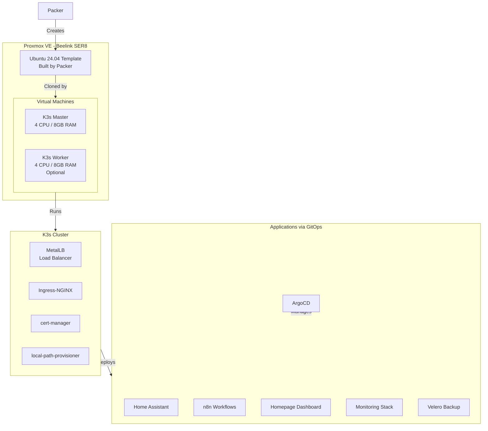

# Homelab Infrastructure as Code

Complete Infrastructure-as-Code automation for a production-ready homelab running on Proxmox with K3s Kubernetes.

## 🎯 Overview

This repository provides a fully automated homelab deployment using:
- **Packer** - Build reproducible Ubuntu 24.04 VM templates
- **OpenTofu** - Provision multi-VM K3s cluster infrastructure
- **Ansible** - Configure cluster, install K3s, networking, monitoring
- **ArgoCD** - GitOps-based application deployment
- **Taskfile** - Orchestrate the entire workflow

**One command deploys everything**: `task bootstrap`

## 🏗️ Architecture



## 🚀 Quick Start

### Prerequisites

1. **Proxmox VE 8.x** installed on hardware
2. **macOS/Linux workstation** with:
   - Task (Taskfile)
   - Packer
   - OpenTofu/Terraform
   - Ansible
   - kubectl
   - Helm

### Installation

```bash
# 1. Install dependencies on macOS
task workstation:install

# 2. Configure Proxmox
task proxmox:setup

# 3. Deploy everything
task bootstrap
```

That's it! The `bootstrap` task will:
1. Build Ubuntu 24.04 template with Packer (~15 min)
2. Provision VMs with OpenTofu (~5 min)
3. Configure K3s cluster with Ansible (~10 min)
4. Deploy applications via ArgoCD (~10 min)

**Total time**: ~40 minutes

## 📁 Repository Structure

```
homelab/
├── packer/                    # VM template builder
│   ├── ubuntu-noble.pkr.hcl   # Packer template
│   ├── http/                  # Cloud-init configs
│   └── scripts/               # Provisioning scripts
├── opentofu/                  # Infrastructure provisioning
│   ├── main.tf                # Root configuration
│   ├── modules/
│   │   └── k3s-node/          # K3s node module
│   └── templates/             # Ansible inventory template
├── ansible/                   # Configuration management
│   ├── site.yml               # Main playbook
│   └── playbooks/
│       ├── 00-base-os.yml
│       ├── 01-k3s-cluster.yml
│       ├── 02-storage.yml
│       ├── 03-networking.yml  # MetalLB + Ingress-NGINX
│       ├── 04-security.yml    # cert-manager
│       ├── 05-monitoring.yml  # Prometheus + Grafana + Loki
│       ├── 06-gitops.yml      # ArgoCD
│       └── 07-backup.yml      # Velero
├── gitops/                    # Application manifests
│   ├── bootstrap/
│   │   └── root-app.yaml      # ArgoCD app-of-apps
│   └── applications/
│       ├── home-assistant/
│       ├── n8n/
│       ├── homepage/
│       ├── nextcloud/
│       ├── ollama/
│       └── monitoring/
├── taskfiles/                 # Task orchestration
│   ├── packer/
│   ├── opentofu/
│   ├── ansible/
│   ├── gitops/
│   └── proxmox/
└── Taskfile.yml               # Root task definitions
```

## 🎮 Common Commands

```bash
# Bootstrap entire homelab
task bootstrap

# Individual components
task packer:build              # Build VM template
task opentofu:apply            # Create VMs
task ansible:run               # Configure cluster
task gitops:bootstrap          # Deploy applications

# Management
task gitops:status             # Check application status
task gitops:login              # Get ArgoCD password
task ansible:get-kubeconfig    # Fetch kubeconfig

# Destroy
task destroy                   # Destroy all infrastructure
```

## 🌐 Services

After deployment, access your services:

| Service | URL | Description |
|---------|-----|-------------|
| **Homepage** | https://dashboard.homelab.local | Central dashboard |
| **Home Assistant** | https://home.homelab.local | Smart home platform |
| **n8n** | https://n8n.homelab.local | Workflow automation |
| **Nextcloud** | https://nextcloud.homelab.local | File storage & collaboration |
| **Ollama** | https://ollama.homelab.local | Local LLM (ChatGPT-like) |
| **Uptime Kuma** | https://uptime.homelab.local | Uptime monitoring |
| **ArgoCD** | `task gitops:login` | GitOps management |
| **Grafana** | Port-forward 3000 | Monitoring dashboards |

> **Note**: Add these domains to your `/etc/hosts` or configure local DNS to point to the MetalLB LoadBalancer IP.

## 🔧 Configuration

### Environment Variables

Copy `.env.example` to `.env` and configure:

```bash
PROXMOX_HOST=192.168.1.100
PROXMOX_NODE=pve
PROXMOX_API_TOKEN=terraform@pve!opentofu=<secret>

# Derived variables
PROXMOX_API_URL=https://${PROXMOX_HOST}:8006/api2/json
PROXMOX_API_TOKEN_ID=terraform@pve!opentofu
PROXMOX_API_TOKEN_SECRET=<secret>
```

### OpenTofu Variables

Edit `opentofu/terraform.tfvars`:

```hcl
# K3s Cluster
k3s_master_cpu_cores = 4
k3s_master_memory    = 8192
k3s_master_disk_size = 100

worker_count = 1  # Set to 0 for single-node cluster
```

## 💾 Backup & Restore

Backups are handled by Velero:

```bash
# Create backup
velero backup create my-backup

# List backups
velero backup get

# Restore from backup
velero restore create --from-backup my-backup
```

Backups are stored:  
- **Primary**: K3s cluster storage (SSD1)
- **Secondary**: Configure S3-compatible storage (MinIO/Backblaze)

## 🔄 Adding New Services

1. Create manifest in `gitops/applications/<service-name>/`
2. Create ArgoCD Application in `gitops/applications/<service-name>.yaml`
3. Commit and push to Git
4. ArgoCD auto-syncs within 3 minutes

Or manually: `task gitops:sync`

## 🛠️ Troubleshooting

### VMs not getting IP addresses
```bash
# Check DHCP on your network
# Verify VMs are running in Proxmox UI
```

### Ansible connection failures
```bash
# Test connectivity
task ansible:ping

# Check inventory
task ansible:list-hosts
```

### ArgoCD applications not syncing
```bash
# Check ArgoCD status
task gitops:status

# Force sync
task gitops:sync
```

## 📊 Hardware Specs

**Beelink SER8**
- CPU: AMD Ryzen 7 8845HS (8C/16T)
- RAM: Up to 64GB DDR5
- Storage:
  - SSD1: Proxmox OS + VMs (ext4/LVM-thin)
  - SSD2: Backups (ext4, Proxmox Directory storage)
- Network: 2.5GbE

**Resource Allocation**
- K3s Master: 4 CPU / 8GB RAM / 100GB disk
- K3s Worker: 4 CPU / 8GB RAM / 100GB disk (optional)

## 📝 License

MIT

## 🤝 Contributing

Contributions welcome! Please open an issue or PR.

---

**Built with** ❤️ **for homelabbers**
